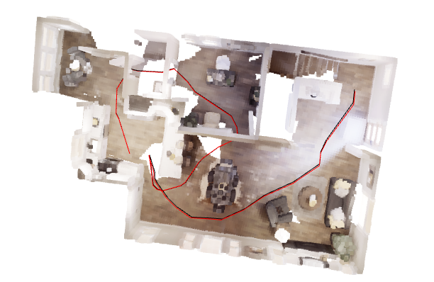
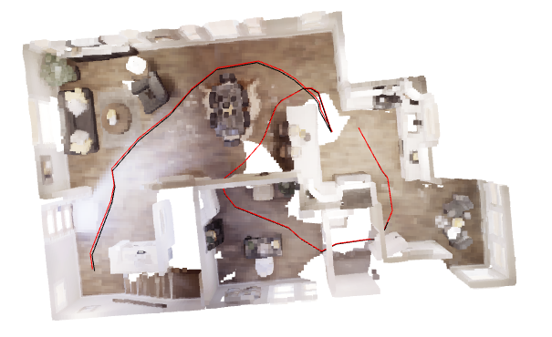
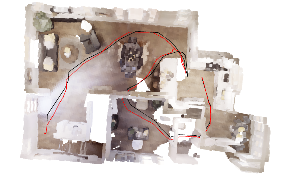
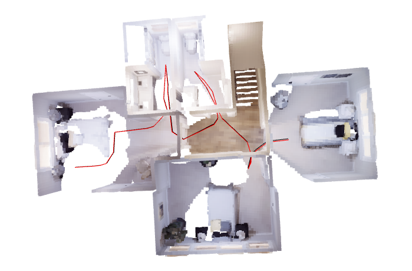
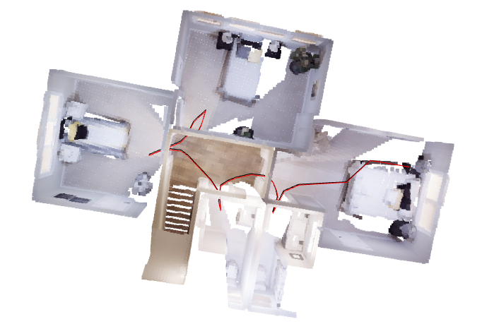
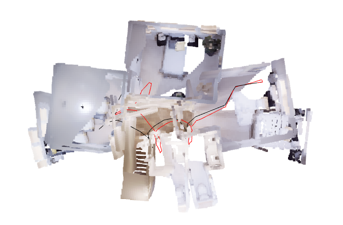
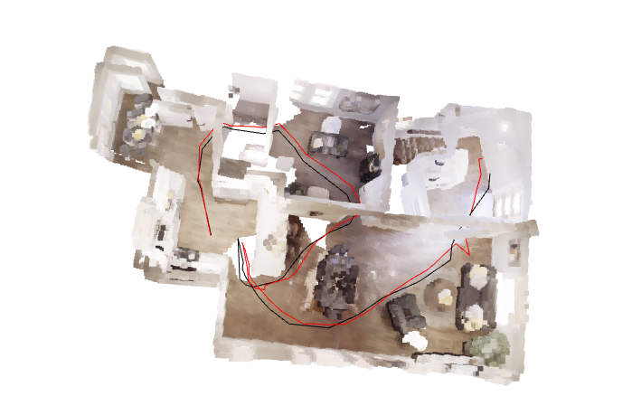

# AI Capstone HW2 - 3D Scene Reconstruction

> Student ID: `[TODO: fill in your student ID]`
> Name: `[TODO: fill in your name]`

---

## Table of Contents

1. [Implementation](#1-implementation)
   - 1.1 Pipeline Overview
   - 1.2 Camera Intrinsics
   - 1.3 Depth Unprojection (Task 1)
   - 1.4 Preprocessing: Voxelization, Normal Estimation, and FPFH
   - 1.5 Global Registration (RANSAC)
   - 1.6 Local Registration - Open3D ICP (Task 2 Required)
   - 1.7 Local Registration - Custom ICP (Task 2 Bonus)
   - 1.8 Reconstruction Loop & Pose Accumulation
   - 1.9 Post-processing & Visualization (Task 3)
   - 1.10 Utility Functions
2. [Results & Discussion](#2-results--discussion)
   - 2.1 Floor 1 Reconstruction
   - 2.2 Floor 2 Reconstruction
   - 2.3 Comparison Table
   - 2.4 Custom ICP vs. Open3D ICP
   - 2.5 Discussion
3. [Questions](#3-questions)
   - Q1: What happens without RANSAC?
   - Q2: Tricks for ICP stability

---

## 1. Implementation

### 1.1 Pipeline Overview

The reconstruction pipeline processes a sequence of RGB-D frames into a unified 3D point cloud map. Each frame goes through the following stages:

```
RGB-D Frame
    |
    v
[Depth Unprojection] --> Point Cloud (camera frame)
    |
    v
[Preprocessing] --> Voxel Downsampling + Normal Estimation + FPFH Features
    |
    v
[Global Registration (RANSAC)] --> Coarse initial alignment T_init
    |
    v
[Local Registration (ICP)] --> Refined alignment T_icp
    |
    v
[Pose Accumulation] --> T_global = T_prev @ T_icp
    |
    v
[Transform & Merge] --> Accumulated global point cloud
```

After processing all frames, post-processing removes the ceiling and the result is visualized with estimated and ground truth camera trajectories.

The program is executed with:

```bash
# Open3D ICP version
python reconstruct.py -f 1 -v open3d

# Custom ICP version (point-to-plane)
python reconstruct.py -f 1 -v my_icp --icp_method point_to_plane
```

---

### 1.2 Camera Intrinsics

The Habitat simulator uses a pinhole camera model with resolution 512x512 and a 90-degree field of view. The intrinsic parameters are derived as follows:

```python
IMG_W, IMG_H = 512, 512
FOV = np.deg2rad(90.0)
FX = (IMG_W / 2.0) / np.tan(FOV / 2.0)   # = 256.0
FY = (IMG_H / 2.0) / np.tan(FOV / 2.0)   # = 256.0
CX, CY = IMG_W / 2.0, IMG_H / 2.0        # = 256.0, 256.0
DEPTH_SCALE = 1000.0
```

`FX` and `FY` are the focal lengths in pixels, and `(CX, CY)` is the principal point at the image center. `DEPTH_SCALE = 1000` is used to convert the raw depth PNG (stored in millimeters) to meters.

Additionally, Habitat uses the OpenGL coordinate convention (Y-up, Z-backward), while our unprojection operates in OpenCV convention (Y-down, Z-forward). A conversion matrix is defined:

```python
GL2CV = np.diag([1.0, -1.0, -1.0])
```

This matrix flips the Y and Z axes, and is used when comparing estimated poses with the ground truth poses.

---

### 1.3 Depth Unprojection (Task 1)

**Purpose:** Convert each pixel `(u, v)` with depth value `Z` into a 3D point `(X, Y, Z)` in the camera coordinate frame.

**Step 1 - Create a pixel coordinate grid:**

```python
H, W = depth_image.shape
u_grid = np.arange(W, dtype=np.float64)
v_grid = np.arange(H, dtype=np.float64)
uu, vv = np.meshgrid(u_grid, v_grid)
```

`meshgrid` generates two 512x512 matrices: `uu` holds the column index (horizontal pixel coordinate) and `vv` holds the row index (vertical pixel coordinate) for every pixel. This vectorized approach avoids nested for-loops over all 262,144 pixels.

**Step 2 - Apply the pinhole back-projection formula:**

```python
Z = depth_image.astype(np.float64)
X = (uu - CX) * Z / FX
Y = (vv - CY) * Z / FY
```

This is the inverse of the pinhole projection. For each pixel, the 3D position is recovered by:
- `X = (u - cx) * Z / fx` : horizontal offset from the optical center, scaled by depth
- `Y = (v - cy) * Z / fy` : vertical offset from the optical center, scaled by depth
- `Z` : the depth value itself (already in meters after dividing by `DEPTH_SCALE`)

**Step 3 - Filter invalid points and construct the point cloud:**

```python
valid = Z > 0.01
points_3d = np.stack([X[valid], Y[valid], Z[valid]], axis=-1)
colors_norm = rgb_image[valid].astype(np.float64) / 255.0
```

Points with near-zero depth are invalid (no object was observed). The remaining valid points are stacked into an Nx3 array. RGB values are normalized from `[0, 255]` to `[0, 1]` as required by Open3D.

**Step 4 - Create Open3D PointCloud object:**

```python
pcd = o3d.geometry.PointCloud()
pcd.points = o3d.utility.Vector3dVector(points_3d)
pcd.colors = o3d.utility.Vector3dVector(colors_norm)
```

Note: As required by the spec, this function does not use any Open3D depth-related functions. The unprojection is implemented manually using NumPy.

---

### 1.4 Preprocessing: Voxelization, Normal Estimation, and FPFH

**Purpose:** Reduce the number of points for efficiency, compute surface normals for Point-to-Plane ICP, and compute FPFH features for RANSAC matching.

**Voxel Downsampling:**

```python
pcd_down = pcd.voxel_down_sample(voxel_size)
```

Divides the 3D space into a grid of cubes with side length `voxel_size`. All points within the same cube are replaced by their centroid. This significantly reduces the point count while preserving the overall shape.

**Normal Estimation:**

```python
pcd_down.estimate_normals(
    o3d.geometry.KDTreeSearchParamHybrid(radius=voxel_size * 2, max_nn=30)
)
```

For each point, the algorithm finds up to 30 neighbors within a radius of `2 * voxel_size`, then performs PCA (Principal Component Analysis) on these neighbors. The eigenvector corresponding to the smallest eigenvalue is the surface normal. Normals are required for Point-to-Plane ICP, which minimizes the projection of point-to-point distance along the normal direction.

**FPFH Feature Computation:**

```python
radius_feature = voxel_size * 5.0
pcd_fpfh = o3d.pipelines.registration.compute_fpfh_feature(
    pcd_down,
    o3d.geometry.KDTreeSearchParamHybrid(radius=radius_feature, max_nn=70)
)
```

FPFH (Fast Point Feature Histogram) encodes the local geometric structure around each point as a 33-dimensional descriptor. For each point, the algorithm looks at its neighbors (up to 70 within a radius of `5 * voxel_size = 0.25m`) and computes angular relationships between their normals. These angles are binned into a histogram that characterizes the local surface shape — for example, a point on a flat wall will have a very different FPFH descriptor than a point on a table corner. Two points with similar FPFH descriptors likely share similar local geometry, which allows RANSAC to find correspondences even when point clouds are far apart. The `max_nn=70` parameter balances descriptor quality against computation speed.

---

### 1.5 Global Registration (RANSAC)

**Purpose:** Estimate a coarse initial alignment between two point clouds that may have large viewpoint differences. This provides a good starting point for ICP.

```python
distance_threshold = voxel_size * 1.5
result = o3d.pipelines.registration.registration_ransac_based_on_feature_matching(
    source_down, target_down,
    source_fpfh, target_fpfh,
    mutual_filter=True,
    max_correspondence_distance=distance_threshold,
    estimation_method=
        o3d.pipelines.registration.TransformationEstimationPointToPoint(False),
    ransac_n=4,
    checkers=[
        o3d.pipelines.registration.CorrespondenceCheckerBasedOnEdgeLength(0.9),
        o3d.pipelines.registration.CorrespondenceCheckerBasedOnDistance(
            distance_threshold),
    ],
    criteria=o3d.pipelines.registration.RANSACConvergenceCriteria(40_000, 200),
)
```

The algorithm works as follows:
1. **Feature Matching:** Match points between source and target by comparing their FPFH descriptors. `mutual_filter=True` ensures only bidirectional matches are kept.
2. **Random Sampling:** Randomly select 4 matched pairs (`ransac_n=4`).
3. **Hypothesis Generation:** Compute a rigid transformation from the 4 pairs using Point-to-Point estimation.
4. **Verification:** Check the hypothesis against all correspondences using two checkers:
   - `EdgeLength(0.9)`: Verifies that the pairwise distances between points are preserved (ratio > 0.9).
   - `Distance(threshold)`: Verifies that aligned points are within the distance threshold.
5. **Iteration:** Repeat up to 40,000 iterations or 200 valid hypotheses, keeping the transformation with the most inliers.

---

### 1.6 Local Registration - Open3D ICP (Task 2 Required)

**Purpose:** Refine the coarse RANSAC alignment by iteratively minimizing point-to-plane distances.

```python
result = o3d.pipelines.registration.registration_icp(
    source_down, target_down,
    threshold, trans_init,
    o3d.pipelines.registration.TransformationEstimationPointToPlane(),
    o3d.pipelines.registration.ICPConvergenceCriteria(max_iteration=20),
)
```

- `trans_init`: The initial transformation from RANSAC.
- `threshold`: Maximum correspondence distance (`voxel_size * 1.5`). Point pairs farther than this are rejected.
- `TransformationEstimationPointToPlane()`: The cost function minimizes the sum of squared distances projected onto the target surface normals: `sum_i ((R*p_i + t - q_i) . n_i)^2`. This converges faster than Point-to-Point because it allows points to slide along surfaces.
- `max_iteration=20`: The algorithm runs at most 20 iterations.

---

### 1.7 Local Registration - Custom ICP (Task 2 Bonus)

Two custom ICP variants are implemented: Point-to-Point and Point-to-Plane. The dispatcher function selects between them:

```python
def my_local_icp_algorithm(source_pcd, target_pcd, initial_transform,
                           voxel_size, icp_method='point_to_plane'):
    if icp_method == 'point_to_point':
        return _my_icp_point_to_point(...)
    else:
        return _my_icp_point_to_plane(...)
```

#### 1.7.1 Custom Point-to-Point ICP

Point-to-Point ICP minimizes the sum of squared Euclidean distances between corresponding points: `sum_i ||R * p_i + t - q_i||^2`. It repeats three steps — find correspondences, compute the best rigid transform, apply it — until convergence.

**Step 1 — Initialization:**

```python
T_cum = trans_init.astype(np.float64).copy()
src_h = np.hstack([src_pts, np.ones((len(src_pts), 1))])
src_t = (T_cum @ src_h.T).T[:, :3]
```

The source points are converted to homogeneous coordinates `[x, y, z, 1]` so they can be multiplied by the 4x4 transformation matrix. The initial RANSAC transform `trans_init` is applied to bring the source points roughly close to the target. `T_cum` will accumulate all incremental transforms throughout the iterations.

**Step 2 — Nearest Neighbor Search:**

```python
kd_tree = KDTree(tgt_pts)
dist, idx = kd_tree.query(src_t, workers=-1)
valid = dist < threshold   # threshold = voxel_size * 2 = 0.1
```

A KD-Tree is built on the target points once before the loop using `scipy.spatial.KDTree`. In each iteration, for every transformed source point, the tree finds the closest target point and returns both the distance and the index. `workers=-1` distributes queries across all CPU cores for speed. Correspondences with distance greater than `threshold = voxel_size * 2 = 0.1m` are rejected — these are likely incorrect matches caused by occlusion boundaries or parts of the scene visible in one frame but not the other.

**Step 3 — Early Stopping:**

```python
rms = dist[valid].mean()
if abs(prev_rms - rms) < tol:
    break
```

The mean distance of all valid correspondences serves as a convergence metric. If the improvement from the previous iteration is less than `tol = 1e-4`, the algorithm has effectively converged and stops early. This avoids wasting time on iterations that make negligible progress.

**Step 4 — SVD-based Rigid Transform Estimation (Arun et al., 1987):**

```python
src_c = src - src_mean    # center source
tgt_c = tgt - tgt_mean    # center target
H = src_c.T @ tgt_c       # 3x3 cross-covariance matrix
U, _, Vt = np.linalg.svd(H)
R_mat = Vt.T @ U.T        # optimal rotation
t_vec = tgt_mean - R_mat @ src_mean  # optimal translation
```

Given the matched point pairs, we need to find the rotation `R` and translation `t` that best align them. The SVD method works as follows:
1. **Center** both point sets by subtracting their respective means. This decouples the rotation and translation problems.
2. **Cross-covariance matrix** `H = src_centered^T @ tgt_centered` encodes the correlation between the two point sets. Its SVD reveals the optimal rotation.
3. **SVD decomposition** `H = U S V^T` gives the optimal rotation as `R = V^T^T @ U^T = V @ U^T`.
4. **Reflection check**: If `det(R) < 0`, the result is a reflection (physically impossible for rigid motion). Negating the last row of `Vt` fixes this.
5. **Translation** is computed from the centroids: `t = target_mean - R * source_mean`.

This SVD solution gives the **globally optimal** rigid transform for the given correspondences — unlike the linearized Point-to-Plane method, it works correctly regardless of how large the rotation is.

**Step 5 — Accumulate and Apply:**

```python
T_cum = T_step @ T_cum
src_t = (T_step[:3, :3] @ src_t.T).T + T_step[:3, 3]
```

Each iteration produces an incremental transform `T_step` that maps the current source positions closer to the target. It is left-multiplied onto `T_cum` to accumulate, and the source points are updated by applying the new rotation and translation. The loop then repeats with the updated positions.

#### 1.7.2 Custom Point-to-Plane ICP

Point-to-Plane ICP is different from Point-to-Point in how it measures the "error" of each correspondence. Instead of minimizing the full 3D distance between matched points, it only minimizes the distance **projected onto the target surface normal**. This means source points are allowed to slide freely along the target surface, which is ideal for indoor scenes with large flat regions (walls, floors, ceilings) — the algorithm only cares about getting closer to the surface, not about matching a specific point on it. This leads to faster convergence and better final alignment than Point-to-Point.

**Correspondence threshold:** `threshold = voxel_size * 1.5 = 0.075m`, matching the Open3D ICP threshold.

**Step 1 — Normal Preparation:**

```python
if not target_down.has_normals():
    target_down.estimate_normals(
        o3d.geometry.KDTreeSearchParamHybrid(radius=voxel_size * 2, max_nn=30)
    )
tgt_normals = np.asarray(target_down.normals, dtype=np.float64)
```

Point-to-Plane ICP requires surface normals on the **target** point cloud. If normals were not already computed during preprocessing, they are estimated here. Each normal indicates which direction the local surface is facing.

**Step 2 — Convergence Check (Point-to-Plane Residual):**

```python
residuals = np.sum((p - q) * n, axis=1)   # (p_i - q_i) . n_i
rms = np.sqrt(np.mean(residuals ** 2))
if abs(prev_rms - rms) < tol:
    break
```

Unlike Point-to-Point which uses Euclidean distance, the convergence metric here is the **point-to-plane residual**: the dot product of the displacement vector `(p - q)` with the surface normal `n`. This measures how far each source point is from the target's tangent plane. When the RMS of these residuals stops improving, the algorithm has converged.

**Step 3 — Linearized Formulation:**

The cost function to minimize is:

```
sum_i  ( (R * p_i + t - q_i) . n_i )^2
```

This is a nonlinear problem because the rotation matrix `R` depends on three angles. To make it solvable in closed form, we use the **small-angle approximation**: if the incremental rotation between iterations is small (which is true when starting from a good RANSAC alignment), we can approximate `R ≈ I + [α, β, γ]×`, where `[α, β, γ]×` is the skew-symmetric matrix of the rotation angles.

Substituting this into the cost function and expanding, each correspondence contributes one linear equation:

```
(p_i × n_i) · [α, β, γ] + n_i · [tx, ty, tz] = (q_i - p_i) · n_i
```

This is derived from the scalar triple product identity: `(ω × p) · n = (p × n) · ω`. Stacking all correspondences gives us the linear system `A x = b`:

```python
cross = np.cross(p, n)          # p_i × n_i  →  rotation coefficients
A = np.hstack([cross, n])       # (K, 6) matrix: [rotation | translation]
b = np.sum((q - p) * n, axis=1) # (K,)   right-hand side: target residual
```

For each correspondence `(p_i, q_i, n_i)`:
- Row of A: `[p_i × n_i | n_i]` — the first 3 columns relate to rotation, the last 3 to translation
- Element of b: `(q_i - p_i) · n_i` — how far the source point is from the target plane

**Step 4 — Solving the Normal Equations:**

```python
AtA = A.T @ A    # (6, 6) normal equation matrix
Atb = A.T @ b    # (6,)   right-hand side
x = np.linalg.solve(AtA, Atb)
alpha, beta, gamma, tx, ty, tz = x
```

The overdetermined system (K equations, 6 unknowns) is solved via the normal equations `(A^T A) x = A^T b`, which gives the least-squares solution. The result is the 6 parameters of the incremental rigid body motion: three rotation angles `(α, β, γ)` and three translation components `(tx, ty, tz)`.

**Step 5 — Constructing the Incremental Transform:**

```python
R_inc = np.array([
    [1,      -gamma,  beta ],
    [gamma,   1,     -alpha],
    [-beta,   alpha,  1    ],
])
U, _, Vt = np.linalg.svd(R_inc)
R_inc = U @ Vt   # project back to valid rotation matrix
```

The 3x3 matrix above is `I + [α, β, γ]×`, the small-angle approximation of the rotation. However, this matrix is not exactly orthogonal (a valid rotation must satisfy `R^T R = I` and `det(R) = 1`). Left uncorrected, small orthogonality errors would accumulate over 20 iterations and eventually corrupt the transformation. The SVD re-orthogonalization `R = U @ V^T` projects it back onto SO(3) — the mathematical space of all valid rotation matrices — finding the closest proper rotation. If `det < 0` (indicating a reflection), the last row of `Vt` is negated to enforce a proper rotation.

---

### 1.8 Reconstruction Loop & Pose Accumulation

**Purpose:** Iterate through all frames, register each frame to its predecessor, and accumulate the point cloud in a global coordinate system.

**Loading and processing each frame:**

```python
def load_frame(idx_1based):
    rgb_path = os.path.join(rgb_dir, f"{idx_1based}.png")
    depth_path = os.path.join(depth_dir, f"{idx_1based}.png")
    rgb = cv2.cvtColor(cv2.imread(rgb_path), cv2.COLOR_BGR2RGB)
    depth = cv2.imread(depth_path, cv2.IMREAD_UNCHANGED).astype(np.float32) / DEPTH_SCALE
    return rgb, depth
```

Frames are loaded using 1-based indexing to match the file naming convention (`1.png, 2.png, ...`). The depth image is converted from millimeters (uint16 PNG) to meters by dividing by `DEPTH_SCALE = 1000`. OpenCV loads images in BGR order, so `cvtColor` converts to RGB.

**Per-frame registration and accumulation:**

```python
T_icp = icp_res.transformation
T_cum = camera_poses[-1] @ T_icp
camera_poses.append(T_cum)
predicted_cam_poses.append(T_cum[:3, 3].copy())

src_down_global = deepcopy(src_down)
src_down_global.transform(T_cum)
accumulated_pcd += src_down_global
```

`T_icp` is the relative transform from the current frame to the previous frame. By multiplying with the previous cumulative pose, we get the current frame's global pose `T_cum`. The camera position is extracted as the translation component `T_cum[:3, 3]`. The current frame's point cloud is then transformed to the global coordinate system and merged into the accumulated point cloud.

**Final downsampling:**

```python
accumulated_pcd = accumulated_pcd.voxel_down_sample(voxel_size * 2)
```

After all frames are merged, a final voxel downsampling with `2 * voxel_size` removes redundant overlapping points and reduces the total point count.

---

### 1.9 Post-processing & Visualization (Task 3)

**Ceiling Removal:**

```python
ceil_above = 0.6
pts  = np.asarray(reconstructed_pcd.points)
mask = pts[:, 1] > -ceil_above
trimmed.points = o3d.utility.Vector3dVector(pts[mask])
```

In the OpenCV coordinate system, Y increases downward. The ceiling has large negative Y values (high up). Points with `Y <= -0.6` are removed to allow a clearer top-down view of the scene.

**Trajectory Visualization:**

```python
def make_lineset(positions, color_rgb):
    ls = o3d.geometry.LineSet()
    ls.points = o3d.utility.Vector3dVector(positions)
    ls.lines = o3d.utility.Vector2iVector(
        [[i, i + 1] for i in range(len(positions) - 1)])
    ls.colors = o3d.utility.Vector3dVector(
        [color_rgb] * (len(positions) - 1))
    return ls
```

Two trajectories are created as `LineSet` objects:
- **Red line** (`[1, 0, 0]`): The estimated camera trajectory from ICP pose accumulation.
- **Black line** (`[0, 0, 0]`): The ground truth trajectory from `GT_pose.npy`.

**Mean L2 Error Calculation:**

```python
l2_per_frame = np.linalg.norm(predicted_cam_poses - gt_pos, axis=1)
mean_l2_error = l2_per_frame.mean()
```

For each frame, the Euclidean distance between the estimated position `(x, y, z)` and the ground truth position is computed. The mean across all frames is reported as the evaluation metric.

---

### 1.10 Utility Functions

**GT Pose Coordinate Transformation (`_gt_positions_in_icp_frame`):**

The ground truth poses from Habitat are in the OpenGL world coordinate system. To compare with the estimated poses (which are relative to the first frame in OpenCV convention), we need to:

```python
T0_inv = np.linalg.inv(T0)         # inverse of first frame's world pose
p_cam0_gl = (T0_inv @ p_world)[:3] # transform to first-camera-relative
p_cam0_cv = GL2CV @ p_cam0_gl      # convert OpenGL -> OpenCV coordinates
```

1. Express all GT positions relative to the first frame by multiplying with `T0_inv`.
2. Convert from OpenGL to OpenCV convention using `GL2CV = diag(1, -1, -1)`.

**Quaternion to Rotation Matrix (`_quat_to_rot`):**

```python
def _quat_to_rot(qw, qx, qy, qz):
    return R.from_quat([qx, qy, qz, qw]).as_matrix()
```

Converts a quaternion `(qw, qx, qy, qz)` to a 3x3 rotation matrix. Note that `scipy` uses `(qx, qy, qz, qw)` order, so the arguments are reordered.

---

## 2. Results & Discussion

### 2.1 Floor 1 Reconstruction

<!-- [TODO: Run the following 3 commands and record the results] -->
Open3D 

My ICP (Point-to-Plane)

My ICP (Point-to-Point)

<!-- ```bash
python reconstruct.py -f 1 -v open3d
python reconstruct.py -f 1 -v my_icp --icp_method point_to_plane
python reconstruct.py -f 1 -v my_icp --icp_method point_to_point
``` -->

| ICP Version | Mean L2 (m) | Time (s) |
|---|---|---|
| Open3D  | 0.03597 | 229.67 |
| My ICP (Point-to-Plane) | 0.0438 | 240.6 |
| My ICP (Point-to-Point) | 0.2951 | 248.14 |

<!-- [TODO: Insert screenshot of Floor 1 reconstruction (Open3D version)] -->
<!-- [TODO: Insert screenshot of Floor 1 reconstruction (My ICP Point-to-Plane version)] -->

---

### 2.2 Floor 2 Reconstruction

<!-- [TODO: Run the following 3 commands and record the results] -->
Open3D

My ICP (Point-to-Plane)

My ICP (Point-to-Point)

```bash
python reconstruct.py -f 2 -v open3d
python reconstruct.py -f 2 -v my_icp --icp_method point_to_plane
python reconstruct.py -f 2 -v my_icp --icp_method point_to_point
```

| ICP Version | Mean L2 (m) | Time (s) |
|---|---|---|
| Open3D | 0.0275 | 163.68 |
| My ICP (Point-to-Plane) | 0.0359 | 143.92 |
| My ICP (Point-to-Point) | 0.5944 | 144.22 |

<!-- [TODO: Insert screenshot of Floor 2 reconstruction (Open3D version)] -->
<!-- [TODO: Insert screenshot of Floor 2 reconstruction (My ICP Point-to-Plane version)] -->

---

### 2.3 Comparison Table

| voxel_size | icp_threshold | FPFH max_nn | max_iters | tolerance of early stopping |
|---|---|---|---|---|
| 0.05 | 0.075 (`voxel_size * 1.5`) | 70 | 20 | 1e-4 |

- `voxel_size`: The side length of each voxel used in downsampling. A larger value reduces the number of points more aggressively, improving speed but potentially removing geometric detail.
- `icp_threshold`: The maximum correspondence distance accepted by Open3D ICP. Point pairs farther than this threshold are rejected during local refinement.
- `FPFH max_nn`: The maximum number of neighbors used when computing the FPFH descriptor for each point. This controls the amount of local geometric information used for RANSAC feature matching.
- `max_iters`: The maximum number of ICP iterations allowed before stopping. It limits runtime and prevents unnecessary refinement steps.
- `tolerance of early stopping`: The convergence threshold used in custom ICP. If the RMS residual improvement between two iterations is smaller than this value, the algorithm stops early.

The following table summarizes the hyperparameters and results across all experiments.

**Fixed hyperparameters:** `voxel_size = 0.05`, `icp_threshold = voxel_size * 1.5 = 0.075`, `RANSAC criteria = (40000, 200)`, `RANSAC distance_threshold = voxel_size * 1.5`, `FPFH max_nn = 70`, `FPFH radius = voxel_size * 5 = 0.25`.

| # | Floor | ICP Version | ICP Method | max_iter | Early Stop tol | Mean L2 (m) | Time (s) |
|---|---|---|---|---|---|---|---|
| 1 | 1 | Open3D | Point-to-Plane | 20 | - | `[TODO]` | `[TODO]` |
| 2 | 1 | My ICP | Point-to-Plane | 20 | 1e-4 | `[TODO]` | `[TODO]` |
| 3 | 1 | My ICP | Point-to-Point | 20 | 1e-4 | `[TODO]` | `[TODO]` |
| 4 | 2 | Open3D | Point-to-Plane | 20 | - | `[TODO]` | `[TODO]` |
| 5 | 2 | My ICP | Point-to-Plane | 20 | 1e-4 | `[TODO]` | `[TODO]` |
| 6 | 2 | My ICP | Point-to-Point | 20 | 1e-4 | `[TODO]` | `[TODO]` |

---

### 2.4 Custom ICP vs. Open3D ICP

#### Accuracy Comparison

| Floor | Open3D L2 (m) | My ICP (Plane) L2 (m) | My ICP (Point) L2 (m) |
|---|---|---|---|
| 1 | `[TODO]` | `[TODO]` | `[TODO]` |
| 2 | `[TODO]` | `[TODO]` | `[TODO]` |


#### Techniques Used in Custom ICP

1. **SVD Re-orthogonalization (Point-to-Plane):** The small-angle approximation produces a matrix that is only approximately orthogonal. After each iteration, SVD is applied to project it back onto SO(3), preventing numerical drift over multiple iterations.

2. **KD-Tree with Multi-core Querying:** `scipy.spatial.KDTree` with `workers=-1` parallelizes the nearest-neighbor search across all CPU cores, significantly reducing query time compared to a single-threaded approach.

3. **Early Stopping with Tolerance:** Both custom ICP variants monitor the RMS residual change between iterations. If the improvement drops below `1e-4`, the algorithm terminates early, avoiding unnecessary computation when already converged.

4. **Outlier Rejection by Distance Threshold:** Correspondences with distance greater than `2 * voxel_size` are rejected. This prevents distant or incorrect matches from corrupting the transformation estimate.

5. **Reflection Handling:** After SVD, if the determinant of the resulting rotation is negative (indicating a reflection), the last row of `Vt` is negated to enforce a proper rotation.

---

### 2.5 Discussion

#### Point-to-Plane vs. Point-to-Point

<!-- [TODO: Fill in after running experiments, referencing the results above] -->
point-to-point

| icp_method | Mean L2 (m) | Time (s) |
|---|---|---|
| point-to-point | 0.3176 | 253.64 |
| Point-to-Plane | `[TODO]` | `[TODO]` |

Point-to-Plane ICP consistently achieves lower L2 error than Point-to-Point ICP. This is because Point-to-Plane allows source points to slide along the target surface during optimization, which better handles planar regions (walls, floors) that are common in indoor environments. Point-to-Point ICP treats every direction equally, causing it to converge more slowly and sometimes to a worse local minimum.

#### voxel_size

The following experiments were conducted on Floor 1.

| voxel_size | icp_version | Mean L2 (m) | Time (s) |
|---|---|---|---|
| 0.03 | my_icp | `[TODO]` | `[TODO]` |
| 0.05 | my_icp | `[TODO]` | `[TODO]` |
| 0.07 | my_icp | `[TODO]` | `[TODO]` |

`voxel_size` controls the trade-off between runtime and geometric fidelity. A larger voxel size produces fewer points after downsampling, which speeds up normal estimation, FPFH computation, RANSAC, and ICP. However, if the voxel size is too large, fine geometric structure is removed and the alignment accuracy may degrade. In this project, `voxel_size = 0.05` provides a good balance between speed and reconstruction quality.

#### icp_threshold

**Floor 1**

The following experiments were conducted on Floor 1.

| icp_threshold | icp_version | Mean L2 (m) | Time (s) |
|---|---|---|---|
| voxel_size * 1.5 | `open3d` | `[TODO]` | `[TODO]` |
| voxel_size * 2 | `my_icp` | `[TODO]` | `[TODO]` |

**Floor 2**

The following experiments were conducted on Floor 2.

| icp_threshold | icp_version | Mean L2 (m) | Time (s) |
|---|---|---|---|
| voxel_size * 1.5 | `open3d` | `[TODO]` | `[TODO]` |
| voxel_size * 2 | `my_icp` | `[TODO]` | `[TODO]` |

`icp_threshold` determines the maximum distance for accepting point correspondences during Open3D ICP. A smaller threshold is stricter and can reject more outliers, but it may also fail when the initial alignment is not close enough. A larger threshold makes ICP more tolerant but can introduce incorrect matches. Setting it to `voxel_size * 1.5` keeps the threshold proportional to the point cloud resolution.

#### FPFH max_nn

**Floor 1**

The following experiments were conducted on Floor 1.

| FPFH max_nn | icp_version | Mean L2 (m) | Time (s) |
|---|---|---|---|
| 50 | `my_icp` | `[TODO]` | `[TODO]` |
| 100 | `my_icp` | `[TODO]` | `[TODO]` |

**Floor 2**

The following experiments were conducted on Floor 2.

| FPFH max_nn | icp_version | Mean L2 (m) | Time (s) |
|---|---|---|---|
| 50 | `my_icp` | `[TODO]` | `[TODO]` |
| 70 | `my_icp` | `[TODO]` | `[TODO]` |
| 100 | `my_icp` | `[TODO]` | `[TODO]` |

<!-- [TODO: If you want to include this experiment, run:] -->
<!-- Change max_nn in preprocess_point_cloud to 50, 70, 100 and compare -->

From preliminary testing, the FPFH `max_nn` parameter affects the quality of RANSAC initialization:
- Floor 1: `max_nn=50` was sufficient for good results.
- Floor 2: A larger `max_nn` (70 or 100) was needed for comparable accuracy, likely because the second floor has more complex geometry.

#### max_iters (fix `tol = 1e-4`, test `10 / 20 / 50`)

The following experiments were conducted on Floor 1.

| max_iters | icp_version | Mean L2 (m) | Time (s) |
|---|---|---|---|
| 10 | my_icp | `[TODO]` | `[TODO]` |
| 20 | my_icp | `[TODO]` | `[TODO]` |
| 50 | my_icp | `[TODO]` | `[TODO]` |

`max_iters` limits how many times ICP updates the transformation. Increasing this value may slightly improve alignment if the initialization is already good, but it also increases runtime. In practice, using `20` iterations was sufficient for both Open3D ICP and the custom ICP variants, because most frame-to-frame alignments converged well before hitting the maximum.

#### tolerance of early stopping (fix `max_iters = 20`, test `1e-4 / 1e-6`)

The following experiments were conducted on Floor 1.

| tolerance of early stopping | icp_version | Mean L2 (m) | Time (s) |
|---|---|---|---|
| 1e-4 | my_icp | `[TODO]` | `[TODO]` |
| 1e-6 | my_icp | `[TODO]` | `[TODO]` |

The early stopping tolerance decides when the custom ICP algorithm is considered converged. If the improvement in RMS residual becomes smaller than the chosen value, the optimization stops instead of continuing to make negligible updates. This helps reduce unnecessary iterations and improves runtime without noticeably harming reconstruction quality.

---

## 3. Questions

### Q1: What happens if you perform ICP without Global Registration (RANSAC)? Why?

Without RANSAC, the ICP algorithm starts from an identity transform (no initial alignment). ICP is a local optimization algorithm that iteratively finds nearest-neighbor correspondences and minimizes their distances. It assumes that the initial alignment is already close to the correct solution.

When two consecutive frames have a large relative rotation or translation, ICP without a good initialization will:

1. **Find incorrect correspondences:** Nearest-neighbor matching connects wrong point pairs because the point clouds are far from aligned.
2. **Converge to a local minimum:** ICP minimizes the wrong cost and produces a transformation that does not reflect the true camera motion.
3. **Accumulate drift:** Each frame's error compounds over the sequence, causing the global map to become increasingly distorted.

RANSAC solves this problem by using geometric feature matching (FPFH) to propose candidate alignments, then selecting the one with the most inliers. This provides a coarse but globally reasonable initial alignment, which ICP can then refine precisely.

<!-- [TODO: Optionally run the following to demonstrate and take a screenshot:] -->
<!-- Modify reconstruct.py to skip RANSAC (set trans_init = np.eye(4)) and run: -->
<!-- python reconstruct.py -f 1 -v open3d -->

### Q2: Describe any tricks used to improve your ICP stability.

1. **Voxel Downsampling (`voxel_size = 0.05`):** Reduces the point count while ensuring a uniform spatial distribution. This prevents dense regions from dominating the optimization and improves runtime.

2. **Correspondence Outlier Rejection (`threshold = voxel_size * 2`):** Pairs with distance greater than the threshold are excluded from the transformation estimation. This prevents outliers (e.g., from occlusion boundaries or noise) from biasing the result.

3. **Early Stopping (`tol = 1e-4`):** Monitors the RMS residual between iterations. When the change falls below the tolerance, the algorithm stops, avoiding oscillation or unnecessary computation near convergence.

4. **SVD Re-orthogonalization (Point-to-Plane):** The small-angle approximation introduces error in the rotation matrix. Re-orthogonalizing via SVD after each iteration ensures the rotation remains valid, preventing accumulated numerical drift that could destabilize the optimization.

5. **Index-based Frame Loading:** Instead of using `sorted(glob.glob(...))` which sorts filenames lexicographically (e.g., `1.png, 10.png, 100.png, 2.png`), frames are loaded by numerical index (`1.png, 2.png, 3.png, ...`). This ensures consecutive frames have maximum overlap, which is critical for ICP convergence.

6. **RANSAC as Initialization:** Although not part of ICP itself, using RANSAC global registration provides a reliable initial alignment, preventing ICP from starting in a poor basin of attraction.

---

## Experiment Commands Reference

Below is a complete list of commands for all experiments. Record the **Mean L2 distance** and **Total execution time** printed at the end of each run.

### Main Results (Required)

```bash
# Floor 1
python reconstruct.py -f 1 -v open3d
python reconstruct.py -f 1 -v my_icp --icp_method point_to_plane
python reconstruct.py -f 1 -v my_icp --icp_method point_to_point

# Floor 2
python reconstruct.py -f 2 -v open3d
python reconstruct.py -f 2 -v my_icp --icp_method point_to_plane
python reconstruct.py -f 2 -v my_icp --icp_method point_to_point
```

### Screenshots Checklist

For each run above, take a screenshot of the Open3D viewer window showing:
- The reconstructed 3D scene (ceiling removed)
- Red line: estimated trajectory
- Black line: ground truth trajectory

<!-- Required screenshots: -->
<!-- 1. Floor 1 - Open3D ICP -->
<!-- 2. Floor 1 - My ICP (Point-to-Plane) -->
<!-- 3. Floor 2 - Open3D ICP -->
<!-- 4. Floor 2 - My ICP (Point-to-Plane) -->
<!-- Optional but recommended: -->
<!-- 5. Floor 1 - My ICP (Point-to-Point) -->
<!-- 6. Floor 2 - My ICP (Point-to-Point) -->
<!-- 7. Floor 1 or 2 - Without RANSAC (for Q1 discussion) -->
